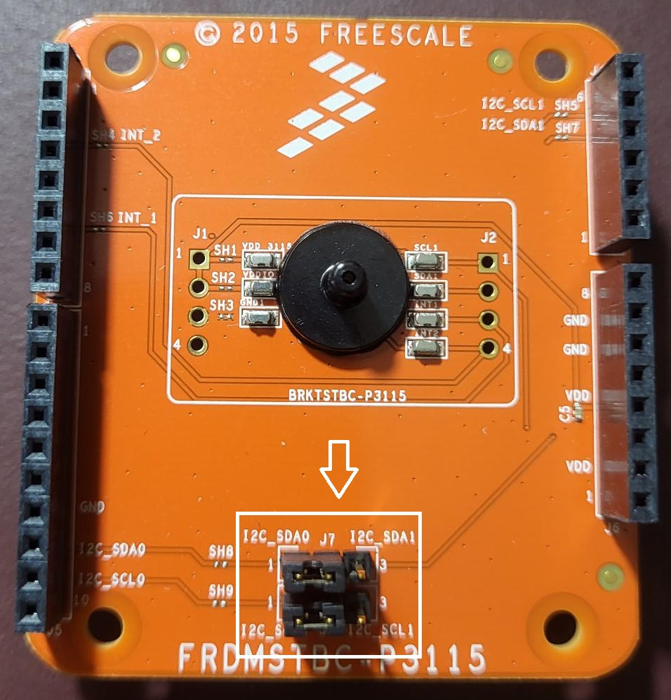
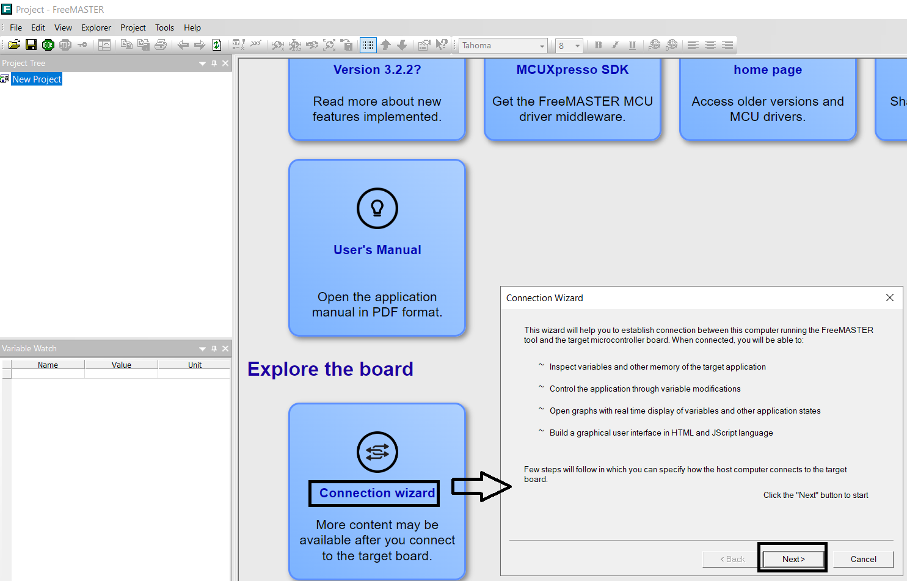
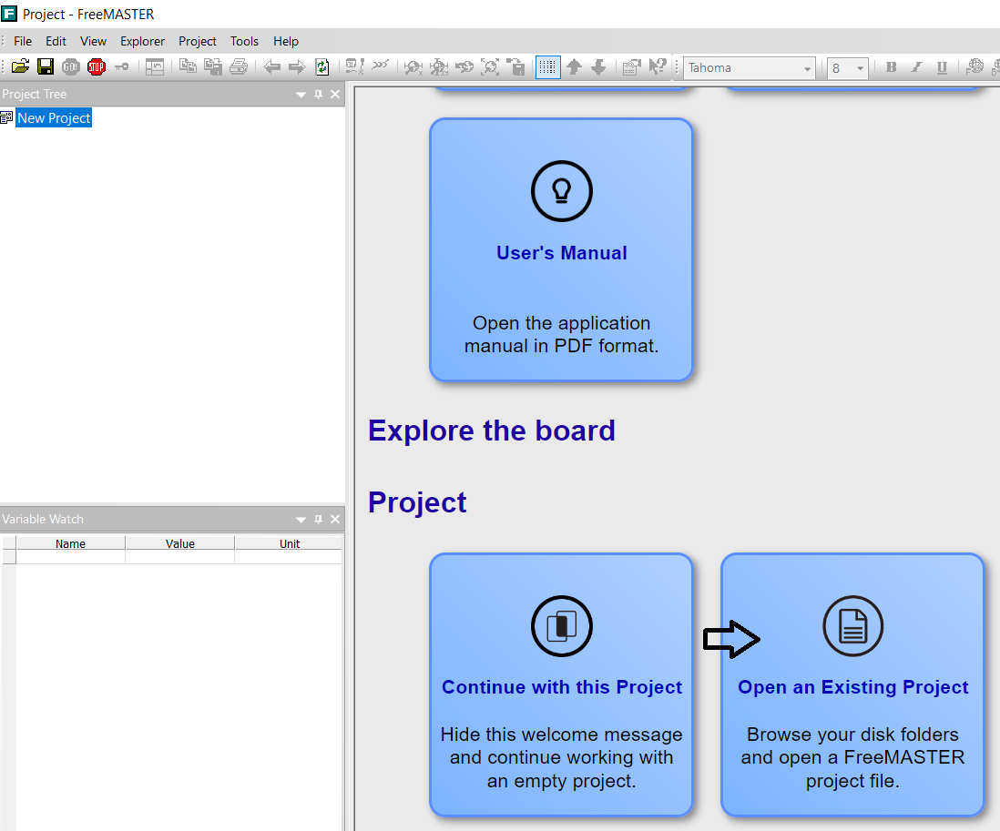
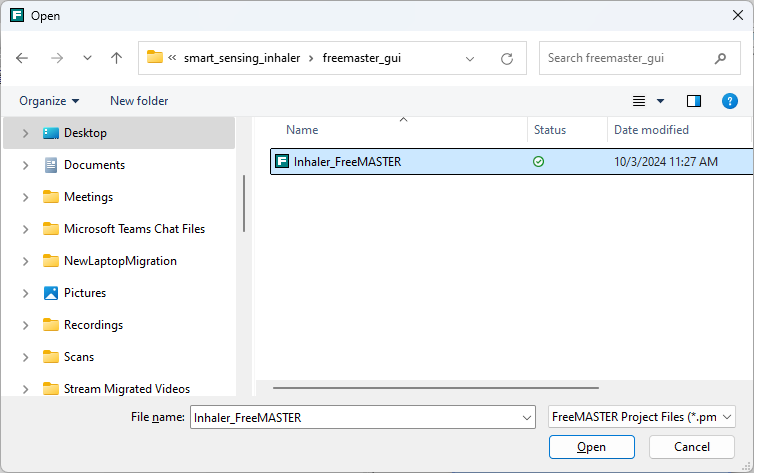
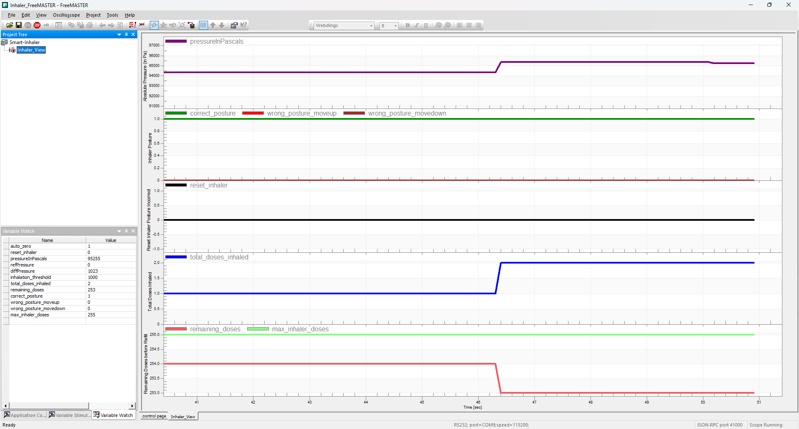
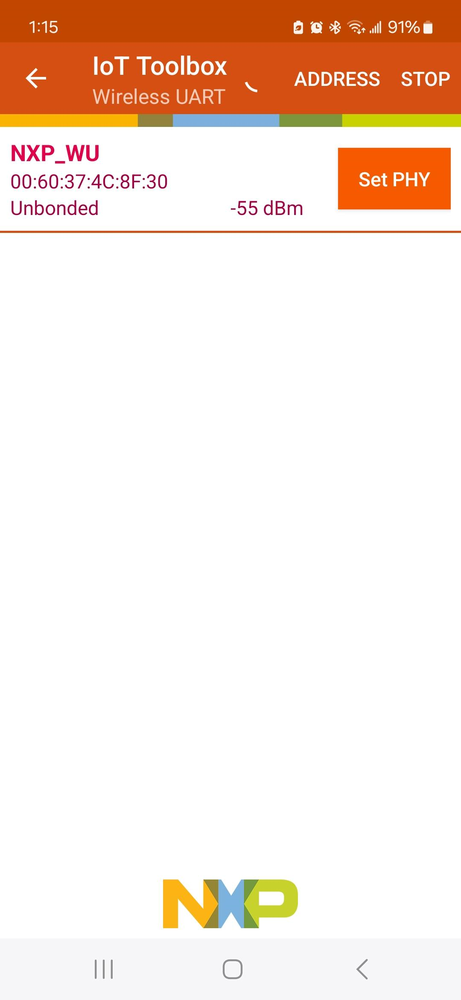
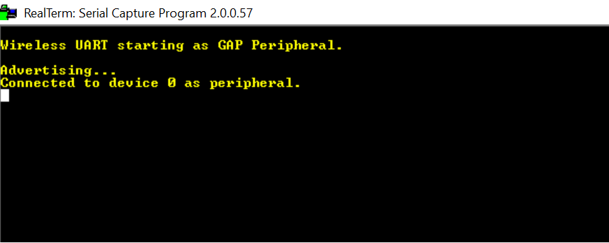
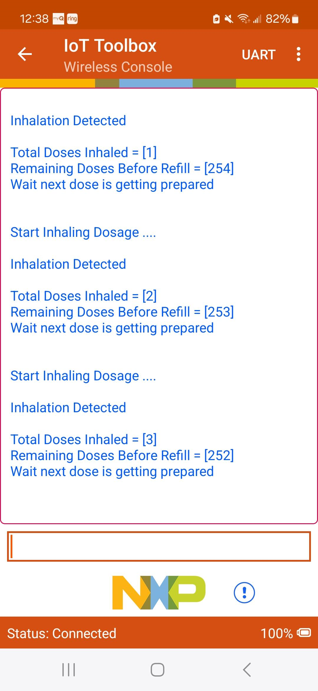

# NXP Application Code Hub

## Smart Sensing Inhaler using Pressure and Tilt sensors

This example use FRDM-MCXW71 and on-board FXLS8974CF accelerometer as Tilt sensor with MPL3115 absolute pressure sensor using expansion board FRDMSTBC-P3115 to demonstrate connected smart sensing inhaler application. <ul><li>The demo showcases detection of tidal breathin pattern of patient to align dosage dispensation using high precision, digital pressure sensor MPL3115. This feature can be used to implement intelligent dosage trigger function.</li><li>The demo also showcases detection of correct inhaler posture to deliver right amount dosage using 3-axis accelerometer FXLS8974CF as Tilt sensor.</li><li>Connected smart inhaler inform on dosages inhaled over BLE wireless UARTallowing remote patient monitoring, helps with patient’s adherence to dosages and compliance.</li></ul>

NOTE: For this demonstration, a syringe with tubing is connected to MPL3115 pressure sensor on FRDMSTBC-P3115 board to simulate pressure change due to patient's inhalation. The pressure threshold is set appropriately and is configurable based on actual inhalation pressure dip pattern.

> #### Boards: FRDM-MCXW71, FRDM-MCXW7X
> #### Accessories: On-Board Accelerometer FXLS8974CF, nxp_frdmstbc_p3115
> #### Categories: Sensor, Wireless Connectivity, Tools
> #### Peripherals: I2C, UART, SENSOR
> #### Toolchains: MCUXpresso IDE

## Table of Contents
1. [Software](#step1)
2. [Hardware](#step2)
3. [Setup](#step3)  
3.1 [Hardware Setup](#step3.1) 
3.2 [Software Setup](#step3.2)
4. [Run Demos](#step4)  
4.1 [Run Demo 1](#step4.1) 
4.2 [Run Demo 2](#step4.2)
5. [Support](#step5)

## 1. Software
- IoT Sensing SDK (ISSDK) v1.8 offered as middleware in MCUXpresso SDK for supported platforms
- MCUXpresso SDKv2.16.0 for FRDM-MCXW71 or newer
- MCUXpresso IDE v11.10.0
- FreeMaster Tool v3.2 or newer
- NXP IoT ToolBox App - Android Store or NXP IoT ToolBox App - Apple Store.

## 2. Hardware
- [FRDM-MCXW71/7x](https://www.nxp.com/part/FRDM-MCXW71) MCU board with on-board FXLS8974CF accelerometer
- [FRDMSTBC-P3115](https://www.nxp.com/part/FRDMSTBC-P3115) expansion board for MPL3115 absolute pressure sensor.
- 12mm pressure port and a pressure syringe.
- Personal Computer
- Mini/micro C USB cable
- Android or Apple Mobile Phone supprting BLE wireless connectivity.

## 3. Setup

### 3.1 Step 1
### 3.1 Hardware Setup

#### 3.1.1 Step 1: Flashing NBU
- The FRDM-MCXW71 board comes with pre-flashed code in Narrow Band Unit (NBU) for the radio core.
- In case you need to reflash the NBU firmware, please follow instructions available at: 
  [Flash NBU Firmware on FRDM-MCXW71](https://community.nxp.com/t5/MCX-W71-Training-Secure-MCUs-for/FRDM-MCXW71-Hands-On-1-NBU-and-User-Firmware-Update-Using-ISP/ta-p/1970154) 
  [Check NBU Incompatible Versions](https://community.nxp.com/t5/MCX-W71-Training-Secure-MCUs-for/FRDM-MXCW71-Hands-On-2-Recognize-NBU-Incompatible-Versions/ta-p/1970129)

#### 3.1.2 Step 2: Connect Hardware
- Connect FRDM-MCXW71 to FRDM-STBC-P3115 shield board.
- Connect J7 and J8 pins 1-2 on FRDM-STBC-P3115 shield board.  
 
- Make sure to glue a 12mm pressure port to the pressure sensor part (MPL3115 on FRDM-STBC-P3115 board).
- Connect a syringe to the pressure port to be able to apply pressure change.
- Connect a micro USB cable from connector MCU-LINK to a host computer.
- Android or Apple Mobile Phone to see demo output on NXP IoT ToolBox App.  
The image below show the Hardware Setup: 
 

### 3.2 Software Setup

#### 3.2.1 Step 1: Download and Install required Software(s)
- Download and Install [MCUXpresso IDE v11.10.0 or newer](https://www.nxp.com/design/design-center/software/development-software/mcuxpresso-software-and-tools-/mcuxpresso-integrated-development-environment-ide:MCUXpresso-IDE)
- Download and Install [MCUXpresso SDKv2.16.0 for FRDM-MCXW71 or newer](https://mcuxpresso.nxp.com/en/builder?hw=FRDM-MCXW71)
- Download and Install [FreeMaster Tool v3.2 or newer](https://www.nxp.com/webapp/sps/download/license.jsp?colCode=FMASTERSW&appType=file1&DOWNLOAD_ID=null)
- Download and Install [NXP IoT ToolBox App - Android Store](https://play.google.com/store/apps/details?id=com.freescale.kinetisbletoolbox&hl=en_US&pli=1) or
  [NXP IoT ToolBox App - Apple Store](https://apps.apple.com/us/app/iot-toolbox/id1362450908)

#### 3.2.2 Step 2: Clone the APP-CODE-HUB/dm-tamper-detection-using-low-power-wakeup-sensor-over-ble
- Clone this repository to get the example projects:
- Change directory to cloned project folder: 
    cd *dm-smart-sensing-inhaler*

#### 3.2.3 Step 3: Build example projects
- Open MCUXpresso IDE and select a directory to create your workspace.
- Install MCXUpresso SDK 2.16.0 for FRDM-MCXW71 (drag and drop SDK zip into "Installed SDK" view) into MCUXpresso IDE.
- Go to "Quickstart Panel" and click on "Import Project(s) from file system",
- Select "Project directory (unpacked)" and browse to the cloned project folder.
- Select example project ("smart_sensing_inhaler_fmstr_project" or "smart_sensing_inhaler_ble_project") that you want to open and run.
- Right click on project and select build to start building the project.

## 4 Run Demos

### 4.1 Run Demo 1: Smart Inhaler Demo showcase using FreeMASTER
#### 4.1.1 Step 1: Build and Run Example Project
- Connect a USB-C cable between the host PC and the MCU-Link USB port on the target FRDM-MCXW71 board.
- Choose the "smart_sensing_inhaler_fmstr_project" project.
- Right click on the project and select "Debug As". Select MCUXpresso IDE LinkServer (inc. CMSIS DAP) probes.
- Debugger will start downloading the program to device. MCU-LINK probes will be identified. Click “OK” to continue.
- Click on “Resume” button or press “F8” key on your keyboard to continue running the downloaded program on device.
- Click on “Terminate” button or press “CNTR + F2” to terminate the debug session.
- Disconnect the USB-C cable connected to FRDM-MCXW71 and reconnect. You will see RED LED on the FRDM-MCXW71.
- Wait till you see GREEN LED blinking on FRDM-MCXW71, that will confirm completion of MPL3115 calibration.

#### 4.1.2 Step 2: Open FreeMASTER GUI
- Launch FreeMASTER application installed on your Windows PC.
- Click on "Connection Wizard" and select Next>.  
 
- Select "Use direct connection to on board USB port" and click Next>.
- The FreeMASTER tool detects the COM port (Select the identified COM port on next screen) with the configured baud-rate automatically. Confirm the COM port and baud-rate, click "Next>".  
 
- FreeMASTER detects the board connection and will ask to confirm the detected settings. Confirm by selecting "Yes" and click "Finish".
- FreeMASTER opens an option to "Open an Existing Project". Select the option.  
 
- Browse to "<dm-smart-sensing-inhaler\smart_sensing_inhaler\freemaster_gui/ folder
- Select "Inhaler_FreeMASTER.pmpx" sensor demo project. Click "Open".  
 

#### 4.1.3 Step 3: Run FreeMASTER GUI
- FreeMASTER launches the smart sensing sensor demo.
- Pull the syringe to create change in pressure (similar to when inhalation will be done). The pressure sensor will detect dip in pressure.
- The inhaler will detect the tidal breathing inhalation based on change in pressure, and dosage#1 will be dispensed.
- Wait till you see GREEN LED blinking on FRDM-MCXW71 before pulling the syringe again. 
- One you see GREEN LED blinking, try pulling syringe again and inhaler will show total meds inhaled and total remaining dosages to send refill reminder. The status can be seen on the "Inhaler View".
- While the GREEN LED is blinking, try changing the board up and down, the accelerometer will detect tilt and inform to correct the posture. This status can be seen on the "Inhaler View".  
Click on "Inhaler View" to visualize the inhaler status. 
 

### 4.2 Run Demo 2: Connected Smart Sensing Inhaler using BLE Wireless UART
#### 4.2.1 Step 1: Flash the demo firmware on FRDM-MCXW71 board
- Connect a USB-C cable between the host PC and the MCU-Link USB port on the target FRDM-MCXW71 board.
- Choose the "smart_sensing_inhaler_ble_project" project.
- Right click on the project and select "Debug As". Select MCUXpresso IDE LinkServer (inc. CMSIS DAP) probes.
- Debugger will start downloading the program to device. MCU-LINK probes will be identified. Click “OK” to continue.
- Click on “Resume” button or press “F8” key on your keyboard to continue running the downloaded program on device.
- Click on “Terminate” button or press “CNTR + F2” to terminate the debug session.
- Disconnect the USB-C cable connected to FRDM-MCXW71 and reconnect.

#### 4.2.1 Step 2: Start Advertising
- To enable your board to start its BLE advertising, press and release button SW3.

#### 4.2.2 Step 3: Connect to the IoT ToolBox App
- Open the installed NXP IoT Toolbox (available from Play Store and App Store) on your mobile phone. Make sure bluetooth connection is ON.
- Inside the application, click on the Wireless UART widget. Scan should start automatically.  
  
- When a device called NXP_WU appears, click on it. Your phone should now be connecting to the board.  
  

#### 4.1.3 Step 3: Run the Connected Inhaler Demo
- After connecting with the FRDM-MCXW71 device, the serial UART terminal will show this message:  
  
- Pull the syringe to create change in pressure (similar to when inhalation will be done). The pressure sensor will detect dip in pressure.
- The inhaler will detect the tidal breathing inhalation based on change in pressure, and dosage will be dispensed.
- Wait till you see GREEN LED blinking on FRDM-MCXW71 before pulling the syringe again.
- One you see GREEN LED blinking, try pulling syringe again and inhaler will show total meds inhaled and total remaining dosages to send refill reminder.
- While the GREEN LED is blinking, try changing the board up and down, the accelerometer will detect tilt and inform to correct the posture. The inhaler posture orientation correction message can be seen on the wireless console application. 
  

## 5. Support
- Reach out to NXP Sensors Community page for more support - [NXP Community](https://community.nxp.com/t5/forums/postpage/choose-node/true?_gl=1*fxvsn4*_ga*MTg2MDYwNjMzMy4xNzAyNDE4NzM0*_ga_WM5LE0KMSH*MTcwMjQxODczMy4xLjEuMTcwMjQxODczNi4wLjAuMA..)
- For more details on FXLS8974CF SDCD block, refer to the application note - [AN12004](https://www.nxp.com/docs/en/application-note/AN12004.pdf)
- Learn more about FXLS8974CF 3-axis accelerometer, refer to - [FXLS8974CF DS](https://www.nxp.com/docs/en/data-sheet/FXLS8974CF.pdf)
- Learn more about FXPQ3115 absolute pressure sensor, refer to - [FXPQ3115 DS](https://www.nxp.com/docs/en/data-sheet/FXPQ3115BV.pdf)
- Learn more about MPL3115 absolute pressure sensor, refer to - [MPL3115 DS](https://www.nxp.com/docs/en/data-sheet/MPL3115A2S.pdf)
- Accelerate your sensors development using Sensor ToolBox, refer to - [Sensors Development Ecosystem](https://www.nxp.com/design/design-center/software/sensor-toolbox:SENSOR-TOOLBOXX)

#### Project Metadata

<!----- Boards ----->

<!----- Categories ----->

<!----- Peripherals ----->

<!----- Toolchains ----->

Questions regarding the content/correctness of this example can be entered as Issues within this GitHub repository.

>**Warning**: For more general technical questions regarding NXP Microcontrollers and the difference in expected functionality, enter your questions on the [NXP Community Forum](https://community.nxp.com/)

## 7. Release Notes
| Version | Description / Update                           | Date                        |
|:-------:|------------------------------------------------|----------------------------:|
| 1.0     | Initial release on Application Code Hub        | October 30st 2024 |

## Licensing

*If applicable - note software licensing here with links to licenses, otherwise remove this section*

## Origin

*if applicable - note components your application uses regarding to license terms - with authors / licenses / links to licenses, otherwise remove this section*